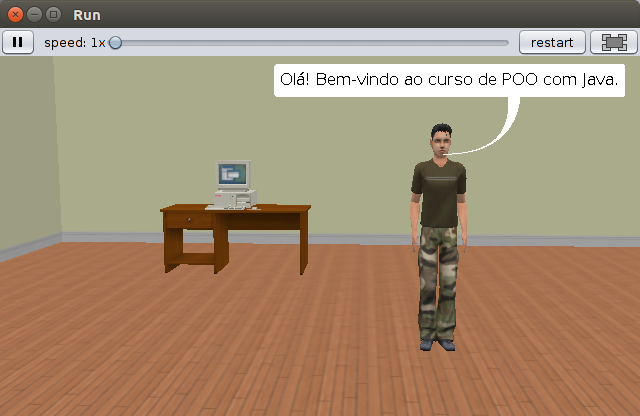
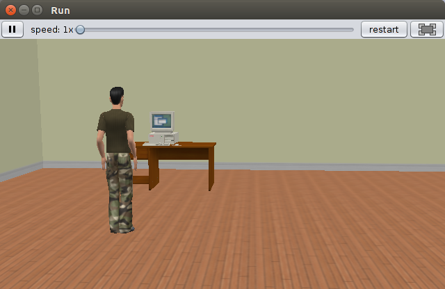
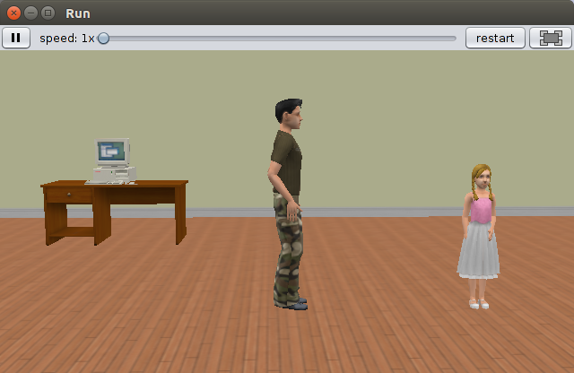
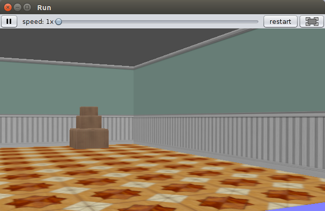
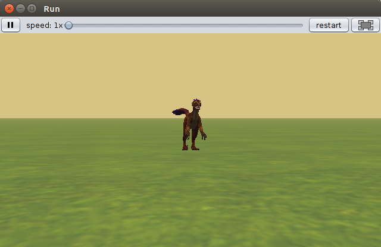

# Projetos utilizando Alice 3.5.0:

Aqui estão disponibilizados alguns projetos que foram utilizados no livro didático. 

| Nome Arquivo Local                        | Imagem                                                          |
|-------------------------------------------|-----------------------------------------------------------------|
| project-hello-world.a3p		            |   |
| project-estudar-java.a3p                  |  |
| project-dancinha-alice.a3p		        |         |
| project-sp-robo.a3p                       |       |
| project-roteiro-aula-pratica.a3p          |               |
