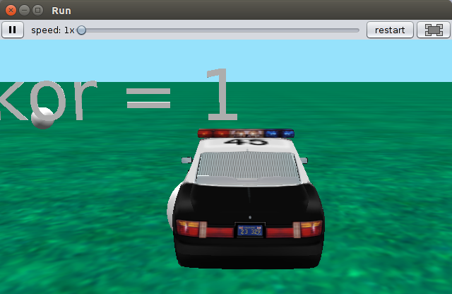
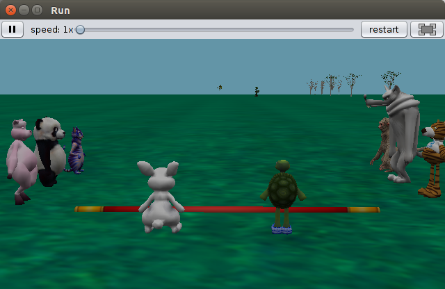
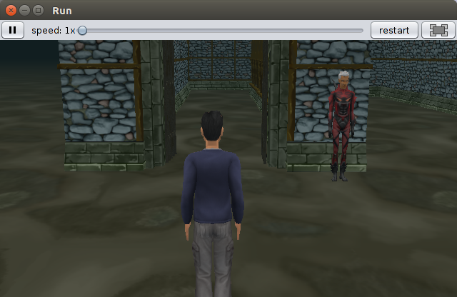
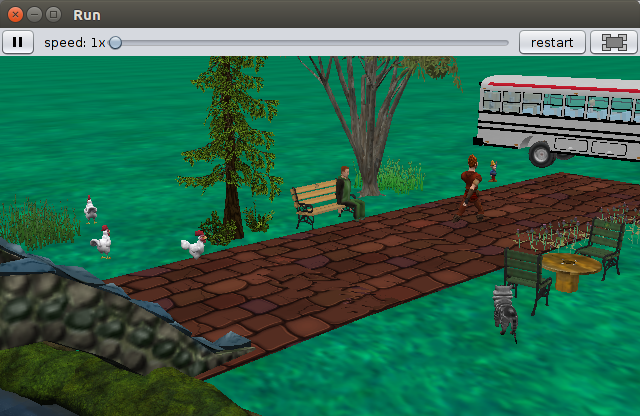

# Projetos de Terceiros:

Aqui estão disponibilizados alguns projetos de terceiros. Estes projetos estão disponibilizados para inspirar os alunos a criarem o seu próprio material. 
Caso deseje recomendo baixar o conteúdo direto do site do autor original. Mas, foi também disponibilizado aqui caso o autor remova o link.

| Nome Arquivo Local                        | Endereço do Projeto Original                   | Nome Arquivo Original       | Imagem                                                         |
|-------------------------------------------|------------------------------------------------|-----------------------------|----------------------------------------------------------------|
| project-game-car-policy.a3p		        | https://github.com/Faris-Ihsan/Alice-3-Project | skor.a3p                    |               |
| project-animation-race-turtle-rabbit.a3p  | https://github.com/wojang-su/Alice3            | finalProject.a3p            |  |
| project-game-walker.a3p		            | https://github.com/DirgaBrajamusti/Alice-3     | The_Maze_Walker.a3p         |            |
| project-animation-dialogue.a3p            | https://github.com/DirgaBrajamusti/Alice-3     | Animation-Jangan_Bohong.a3p |     |
