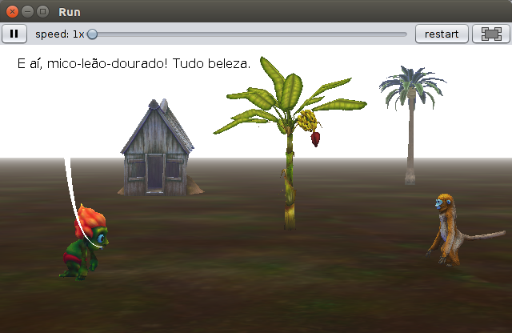

# Projetos utilizando Greenfoot 3.6.1:

Aqui estão disponibilizados alguns projetos que foram utilizados no livro didático. 

| Nome Arquivo Local                        | Conceitos Trabalhados                                                                   | Imagem                                                       |
|-------------------------------------------|-----------------------------------------------------------------------------------------|--------------------------------------------------------------|
| project-hello-world.a3p		            | Animação, inserção de objetos, personagens e métodos simples                            |   |
| project-estudar-java.a3p                  | Animação, inserção de objetos, personagens e métodos mais elaborados                    |  |
| project-dancinha-alice.a3p		        | Animação, inserção de objetos, personagens e métodos com algumas estruturas de controle |         |
| project-sp-robo.a3p                       | Animação, inserção de objetos, movimentação da câmera                                   |       |
| project-roteiro-aula-pratica.a3p          | Animação, inserção de objetos e personagens, criação de diálogos, estruturas de controle, alteração de valores das propriedades |  |
| project-game.a3p          				| Jogo, interação com personagem através de eventos de teclado, mouse e tempo                                              |               |
