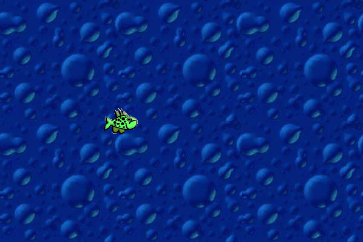
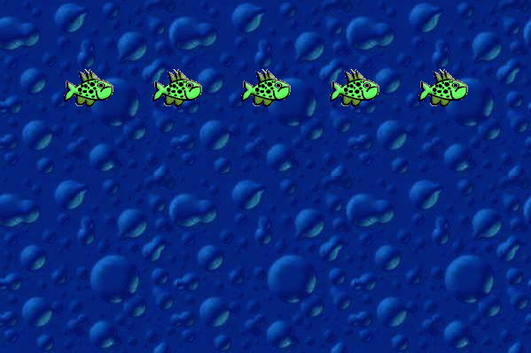
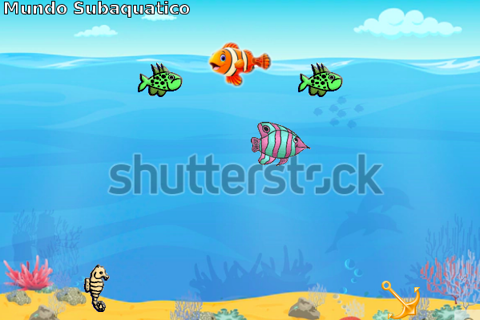
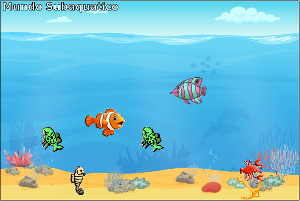

# Projetos utilizando Greenfoot 3.6.1:

Aqui estão disponibilizados alguns projetos que foram utilizados no livro didático. 

| Nome Arquivo Local | Conceitos Trabalhados                             | Imagem                                           |
|--------------------|---------------------------------------------------|--------------------------------------------------|
| project-01		 | Animação, peixe nadando para frente               |  |
| project-02         | Animação, peixes nadando em circulo               |  |
| project-03		 | Animação, diferentes objetos se deslocando        |  |
| project-04         | Jogo, movimentação do personagem                  |  |
| project-06         | Jogo/Simulação - Situação-Problema                |  |

Comando para executar os jogos via terminal: 

```
$ "/usr/share/greenfoot/jdk/bin/java" -cp "/usr/share/greenfoot/javafx/lib/javafx.base.jar:/usr/share/greenfoot/javafx/lib/javafx.controls.jar:/usr/share/greenfoot/javafx/lib/javafx.fxml.jar:/usr/share/greenfoot/javafx/lib/javafx.graphics.jar:/usr/share/greenfoot/javafx/lib/javafx.media.jar:/usr/share/greenfoot/javafx/lib/javafx.properties.jar:/usr/share/greenfoot/javafx/lib/javafx.swing.jar:/usr/share/greenfoot/javafx/lib/javafx.web.jar:/home/jesimar/greenfoot/project-03-java.jar" --module-path "/usr/share/greenfoot/javafx/lib" --add-modules=ALL-MODULE-PATH greenfoot.export.GreenfootScenarioApplication
```

Créditos de algumas imagens utilizadas nas caixas da situação-problema: 

* https://opengameart.org/content/cardboard-box256x256-vector-image
* https://opengameart.org/content/wooden-box256x256-vector-image
* https://opengameart.org/content/simple-toon-wooden-crate-texture

# Galeria do Greenfoot

Link: https://www.greenfoot.org/users/56822
